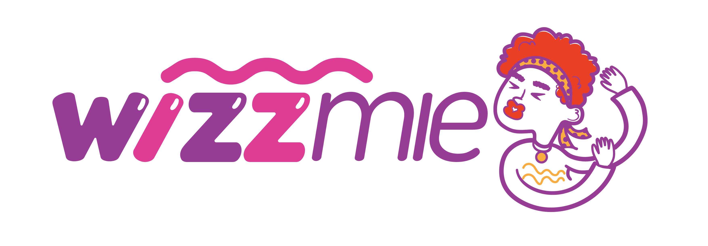

# Wizzmie - Digital Ordering System

Wizzmie adalah platform pemesanan makanan digital modern yang dirancang khusus untuk meningkatkan pengalaman pelanggan di restoran Wizzmie. Sistem ini memungkinkan pelanggan untuk memilih meja secara langsung, memesan menu favorit, dan melakukan pembayaran secara mandiri melalui antarmuka yang premium dan responsif.



## ✨ Fitur Utama

- **Live Table Mapping**: Peta restoran interaktif yang memungkinkan pelanggan melihat status ketersediaan meja secara real-time.
- **Dynamic Menu**: Daftar menu lengkap dengan kategori (Mie, Dimsum, Minuman, dll) dan sistem keranjang belanja yang intuitif.
- **Modern Checkout**: Alur pembayaran yang mulus dengan berbagai metode (QRIS, Virtual Account, Tunai di Kasir).
- **Digital Receipt (Struk)**: Struk pesanan digital dengan estetika printer thermal yang autentik, lengkap dengan fitur cetak.
- **Premium UI/UX**: Menggunakan tema *Modern Light* yang bersih, responsif, dan kaya akan animasi halus (Framer Motion).
- **Mobile First**: Dioptimalkan secara khusus untuk penggunaan di perangkat mobile/smartphone.

## 🚀 Teknologi yang Digunakan

- **Framework**: [Next.js 15 (App Router)](https://nextjs.org/)
- **Styling**: [Tailwind CSS](https://tailwindcss.com/)
- **Animations**: [Framer Motion](https://www.framer.com/motion/)
- **Language**: [TypeScript](https://www.typescriptlang.org/)
- **State Management**: React Context API
- **Icons**: Lucide React / Emojis

## 🛠️ Instalasi & Pengembangan

Pastikan Anda sudah menginstal [Node.js](https://nodejs.org/) di perangkat Anda.

1.  **Clone Repository**
    ```bash
    git clone https://github.com/Kader2637/Wizzmie-meja-website.git
    cd Wizzmie-meja-website
    ```

2.  **Instal Dependensi**
    ```bash
    npm install
    ```

3.  **Jalankan Server Pengembangan**
    ```bash
    npm run dev
    ```
    Buka [http://localhost:3000](http://localhost:3000) di browser Anda.

## 📁 Struktur Proyek

- `src/app`: Berisi rute aplikasi (Page Router).
- `src/components`: Komponen UI yang dapat digunakan kembali (Navbar, Footer, RestaurantMap, dll).
- `src/context`: Pengelolaan state global (OrderContext).
- `src/lib`: Konstanta data menu dan meja.
- `public`: Aset statis (Logo, Gambar, Ikon).

## 📄 Lisensi

Proyek ini dibuat untuk keperluan internal Wizzmie. Seluruh hak cipta desain dan aset gambar dimiliki oleh Wizzmie.

---

Made with ❤️ by Wizzmie Tech Team.
